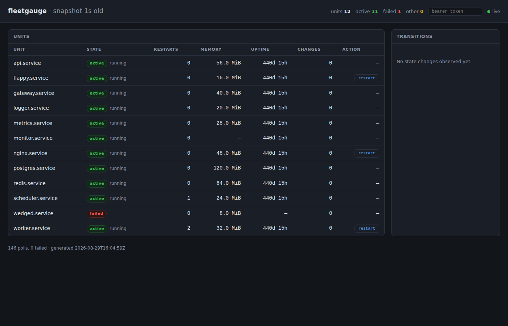

# fleetgauge

One static Go binary that watches a declared fleet of systemd services and
serves one page answering "is everything up?" at a glance — plus Prometheus
metrics, a live SSE feed, and a token-gated restart for the units that opt in.
Ops sensibility as a work sample: restart counts, memory, state transitions,
journal tails, and an interface seam that makes systemd itself swappable in
tests.



## What you need

Go 1.27+. systemd is **not** required for the demo or the test suite — the
fake backend covers every code path.

## Demo in one minute

```
go run ./cmd/fleetgauge -demo
```

Then open `http://127.0.0.1:8080`. You'll see a synthetic twelve-unit fleet
with states drifting in real time over SSE: one unit flapping between active
and failed, another wedged in failure, the rest steady. Use `-addr` to listen
on a different address.

Demo mode is read-only. No restart buttons render unless you pass `-token`,
and even then only units marked `allow_restart: true` in the config show them.
This is deliberate — an unattended demo must not be able to mutate anything.

## Endpoints

| Method | Path | Description |
|--------|------|-------------|
| GET | `/` | The single-page dashboard |
| GET | `/healthz` | 503 until the first poll lands, then 200 |
| GET | `/metrics` | Prometheus text exposition |
| GET | `/events` | SSE transition stream |
| GET | `/units/{name}/journal` | Journal tail drawer |
| POST | `/units/{name}/restart` | Triple-gated restart (bearer token + opt-in + ledger) |

## Real fleet in five minutes

Copy `deploy/fleetgauge.example.yaml`, edit the unit list and the token, and
run with `-config`:

```
go run ./cmd/fleetgauge -config /path/to/fleetgauge.yaml
```

Every key in the example file is documented in its own comments — we don't
duplicate that list here, because two copies of the same list will drift.

## Running it under systemd

`deploy/fleetgauge.service` is the example unit file. Install in four steps:

1. Copy the binary to `/usr/local/bin/fleetgauge`.
2. Put your config at `/etc/fleetgauge/fleetgauge.yaml`.
3. Install the unit to `/etc/systemd/system/fleetgauge.service`.
4. `systemctl daemon-reload && systemctl enable --now fleetgauge`.

`StateDirectory=fleetgauge` is what creates `/var/lib/fleetgauge/` with the
right ownership before the process starts — that is where the example config's
`ledger_path` points.

## Restart is gated three ways

The restart endpoint requires a valid bearer token, the unit must be marked
`allow_restart: true` in the config, and an append-only JSONL ledger line is
written before the backend is touched. A config that sets `allow_restart` on
any unit but leaves `bearer_token` empty fails to load.

## Building and testing

```
make build    # CGO_ENABLED=0 static binary
make test     # go test ./...
make dist     # linux/amd64 + linux/arm64 release binaries
bash verify.sh   # gofmt + vet + test + scrub + README lint
```

CI runs the same `verify.sh` gate.

## What is not proved

The test suite runs entirely against the fake backend, which is what lets it
pass on any OS with no systemd. That means no green build proves the real
systemd backend. `scripts/live-check.sh` is the only thing that does — a human
runs it on a real systemd box — and at the time of writing nobody has. State
that plainly: the systemd backend is unproved, and this repo makes no claim to
the contrary. You cannot claim that fleetgauge has been run against real units.
